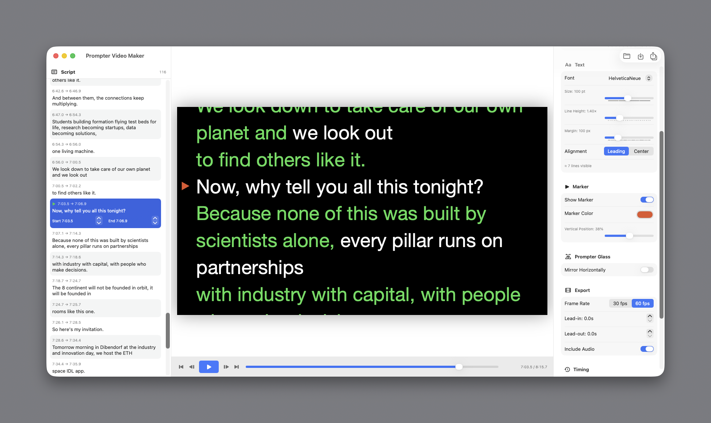

# Prompter Video Maker

Native macOS app that turns audio recordings or time-coded SRT files into
smooth-scrolling teleprompter videos (1920×1080 MP4) with exact timings.

**[⬇ Download the latest release](https://github.com/virtualmagician/PrompterVideoMaker/releases/latest)** —
signed & notarized, universal binary, macOS 15+. Unzip and double-click.



## Features
- Import **SRT** files (speaker prefixes like "Speaker 1:" stripped automatically)
  or **audio** (wav/mp3/m4a/aiff) transcribed **on this Mac** — no cloud, using
  Apple's on-device speech recognition (word-level timings).
- Real prompter scrolling: text moves continuously and smoothly; each cue's first
  line crosses the read marker exactly at its timestamp. Upcoming lines are
  always visible below.
- ~7 lines of large (~“72 pt equivalent”, default 96 px) text; font, size, line
  height, margins and alignment adjustable.
- Read marker arrow (like a hardware prompter), color/position adjustable.
- **Alternating text colors**: long text auto-splits into short sense chunks
  colored alternately (default white/green) so you never lose your line.
- Background color, mirror mode for beam-splitter glass.
- Edit before export: change text, nudge cue times, split/merge/delete segments,
  shift all timings, lead-in/lead-out.
- Live WYSIWYG preview with play/pause/scrub and synced audio.
- Export MP4: H.264 1920×1080 @ 30/60 fps, optionally muxing the original audio.
- Save/load projects (`.prompterproj`).

## Build from source
Requires macOS 15+ and Xcode Command Line Tools.

```bash
Scripts/build_app.sh        # → dist/PrompterVideoMaker.app (signed)
Scripts/notarize.sh         # → notarized + stapled, dist/PrompterVideoMaker-1.0.zip
```

## Headless CLI (for scripting)
```bash
dist/PrompterVideoMaker.app/Contents/MacOS/PrompterVideoMaker \
  --export --srt script.srt --audio voice.wav --out prompter.mp4 --fps 60
# transcribe only:
... --transcribe --audio voice.wav --out script.srt
```
